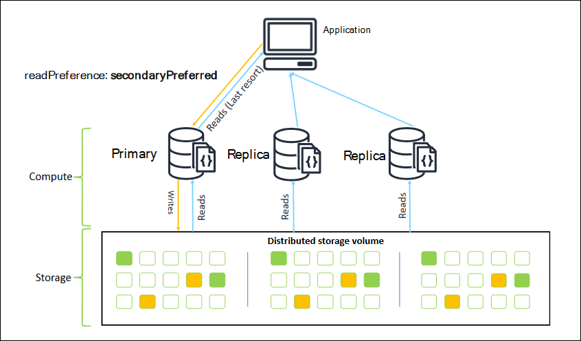
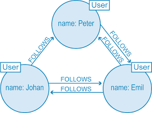
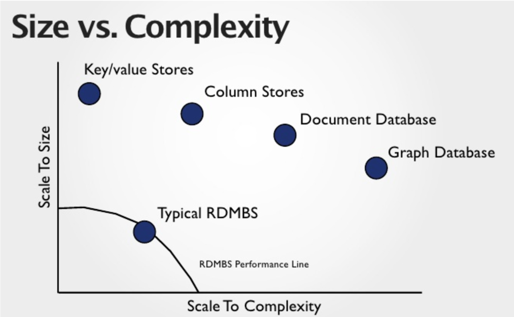

---
presentation:
  width: 1920
  height: 1080
  theme: black.css
  previewLinks: true
---

<!-- slide -->

# BLOCO 23 DIA 1 - Introdução a NoSQL e MongoDB

<!-- slide vertical=true -->

## O que vamos aprender?

* O que é NoSQL
* Mongodb
* Como inserir dados e recuperar dados no Mongo

<!-- slide -->

## O que é NoSQL?

*Not Only SQL* 

<!-- slide vertical=true -->

## Por que utilizar NoSQL?

* Escalabilidade
* Perfomance
* Esquema flexível
* Agilidade

<!-- slide vertical=true -->

### Clusters   

* Tolerância a falhas
* Balanceamento de carga

<!-- slide vertical=true -->



<!-- slide vertical=true -->

### Links úteis

* [Link sobre Clusters](https://www.opservices.com.br/o-que-e-um-cluster/)
* [Manual do Mongo sobre Sharding](https://docs.mongodb.com/manual/sharding/)

<!-- slide vertical=true -->

### [🤔 Dúvidas 🤔](https://wall.sli.do/event/rj9jdhbi?section=700c1f98-8d7b-44b5-8a75-a559a0c28887)

<!-- slide  -->

## Classes de NoSQL

* Chave / Valor - *Key / Value*
* Família de Colunas - Column Family
* Documentos - Document
* Grafos - Graph

<!-- slide vertical=true -->

### Chave / Valor - *Key / Value*

  * O mais simples dos tipos de bancos de dados não relacionais. 
  * Utiliza o método chave-valor para armazenar os dados, em que cada chave representa um identificador exclusivo.

  * Ex: [Redis](https://redis.io/), usado no _twitter_, armazena informações _cache_, permitindo melhor desempenho das aplicações.

<!-- slide vertical=true -->
### Chave / Valor - *Key / Value*


<!-- slide vertical=true -->
### Família de Colunas - *Column Family*

* Armazena informações na forma de colunas. Conseguimos adicionar profundidade as informações, aninhando as estruturas de colunas em famílias, cada uma com sua chave específica. Fazendo um paralelo com o _SQL_ seria como se cada família fosse uma tabela, e cada uma das colunas suas linhas.
* Ex: [Cassandra](https://cassandra.apache.org/), utilizado nas mensagens privadas do _Instagram_.

<!-- slide vertical=true -->

### Família de Colunas - *Column Family*
  


<!-- slide vertical=true -->

### Documentos - *Document*

* Bancos de dados feitos para armazenar informação no formato JSON. 
* É uma solução que permite maior acessibilidade, flexibilidade e escala para o desenvolvedor.
* Ex: [MongoDB](https://docs.mongodb.com/), que acaba, por suas características, sendo muito utilizado em _Big Data_.  

<!-- slide vertical=true -->

### Documentos - *Document*
  


<!-- slide vertical=true -->

### Grafos - *Graph*

* Contém nós e arestas, onde os nós representam entidades e as arestas as relações entre dois nós.

* Ex: [Neo4J](https://neo4j.com/), utilizado no _eBay_, facilita a pesquisa por produtos, prevendo comportamentos dos usuários com analisa os possíveis _caminhos_ entre os nós.

<!-- slide vertical=true -->

### Grafos - *Graph*



<!-- slide vertical=true -->


### Comparação de Complexidade x Escalabilidade



<!-- slide vertical=true -->

### Mais links 

* [StackShare](https://stackshare.io/stacks)
* [SQL x NoSQL](http://db4beginners.com/blog/sql-ou-nosql/)
* [Dani Monteiro](https://github.com/DaniMonteiroDBA)

<!-- slide vertical=true -->

### [🤔 Dúvidas 🤔](https://wall.sli.do/event/rj9jdhbi?section=700c1f98-8d7b-44b5-8a75-a559a0c28887)

<!-- slide -->

# Mongodb

<!-- slide vertical=true -->

## Características

1. O nome vem da palavra inglesa Humongous que em uma tradução livre quer dizer Gigantesco.
2. Ele é escrito em C++.
3. É Open-source.
4. Tem foco em Alta Disponibilidade e Alta Escalabilidade.
5. É suportado pelas principais distribuições de Linux, Windows e também MacOS.
6. Ele trás também o melhor dos dois mundos (relacional e não relacional).

<!-- slide vertical=true -->

### Do lado relacional destacamos:

* Uma Query Language flexível e poderosa
* Consistência forte (podemos ajustar isso de acordo com nossas necessidades)
* Índices secundários: podemos ter mais de um índice por coleção

<!-- slide vertical=true -->
### Do lado não relacional:

* A flexibilidade de arquitetura e schema design
* Escalabilidade
* Performance

<!-- slide vertical=true -->

## Comparando com banco relacional


<!-- slide vertical=true -->

### [🤔 Dúvidas 🤔](https://wall.sli.do/event/rj9jdhbi?section=700c1f98-8d7b-44b5-8a75-a559a0c28887)


<!-- slide -->

## Ferramentas

* Compass
* Robo 3T
* NoSQL Manager
* *Mongo Shell* (o que vamos utilizar)

<!-- slide vertical=true -->

## Como deixar o Mongo Shell mais confortável

* [mongosh](https://github.com/mongodb-js/mongosh)
* [mongo-hack](https://www.github.com/tylerbrock/mongo-hacker/)
* [Todas as Ferramentas](https://docs.mongodb.com/tools/)

<!-- slide vertical=true -->

### [🤔 Dúvidas 🤔](https://wall.sli.do/event/rj9jdhbi?section=700c1f98-8d7b-44b5-8a75-a559a0c28887)

<!-- slide -->

### PAUSA

<!-- slide -->
## MONGO SHELL

```
$ mongo
```

### Primeiros comandos

```js
show dbs;
use <db>;
show collections;
```


<!-- slide vertical=true -->

### [🤔 Dúvidas 🤔](https://wall.sli.do/event/rj9jdhbi?section=700c1f98-8d7b-44b5-8a75-a559a0c28887)

<!-- slide -->
## INSERTS

<!-- slide vertical=true -->

### Escrita

* **Soft State:**  Uma característica do MongoDB, não precisa de possuir estados rígidos, por isso nem sempre são consistentes.

* **Eventually Consistent:** Uma vez possuindo a flexibilidade dada pelo Soft State, explicado anteriormente, vale ressaltar que o sistema se torna consistente no momento devido. Priorizando a disponibilidade sobre a consistência. Lembrar que essas características devem ser levadas em conta na hora que o desenvolvedor desenha sua aplicação.

<!-- slide vertical=true -->

### Lets go!

<!-- slide vertical=true -->

### [🤔 Dúvidas 🤔](https://wall.sli.do/event/rj9jdhbi?section=700c1f98-8d7b-44b5-8a75-a559a0c28887)


<!-- slide -->

## SELECTS

<!-- slide vertical=true -->

### Selecionando tudo de uma colection

```js
db.inventory.find({}); // ou
db.inventory.find();

// equivalente a SELECT * FROM inventory;
```

<!-- slide vertical=true -->

### Especificando uma condição de igualdade

```js
// equivalente a SELECT * FROM inventory WHERE status = "D";
db.inventory.find({ status: "D" }); 
// equivalente a SELECT * FROM inventory WHERE status = "D" AND item = "paper";
db.inventory.find({ status: "D", item: "paper" });
```

<!-- slide vertical=true -->

### Projetando somente os campos requeridos

* query: um documento JSON contendo os filtros que serão aplicados nos documentos;

* projection: outro documento JSON que especifica quais campos dos documentos serão retornados.

<!-- slide vertical=true -->

### EXEMPLO DE PROJEÇÃO

```js
db.inventory.find({ status: "A" }, { item: 1, status: 1 }); // ou
db.inventory.find({ status: "A" }, { item: true, status: true });

db.inventory.find({ status: "A" }, { status: 0 }); //ou
db.inventory.find({ status: "A" }, { status: false });
```

<!-- slide vertical=true -->

### [🤔 Dúvidas 🤔](https://wall.sli.do/event/rj9jdhbi?section=700c1f98-8d7b-44b5-8a75-a559a0c28887)


<!-- slide -->

### Relacionamentos

<!-- slide vertical=true -->

## 1:1 (um para um)**

<!-- slide vertical=true -->

## 1:N (um para muitos)**

<!-- slide vertical=true -->

### Procurando em sub-documentos

```js
db.users.find({ "addresses.state": "NY" }).pretty();
```

<!-- slide vertical=true -->

### [🤔 Dúvidas 🤔](https://wall.sli.do/event/rj9jdhbi?section=700c1f98-8d7b-44b5-8a75-a559a0c28887)


<!-- slide -->

## Métodos de cursor limit() e skip()

<!-- slide vertical=true -->

## **limit()**

```js
db.inventory.find().limit(2);
db.inventory.find({ status: "A" }).limit(1);
```

<!-- slide vertical=true -->

## **skip**
```js
db.inventory.find().skip(2);
```
<!-- slide vertical=true -->

**skip() e limit()**
```js
db.inventory.find({}, { item: 1 }); // retorna todos os cinco documentos
db.inventory.find({}, { item: 1 }).skip(0).limit(2); // retorna o primeiro e segundo documentos
db.inventory.find({}, { item: 1 }).skip(1*2).limit(2); // retorna o terceiro e quarto documentos
db.inventory.find({}, { item: 1 }).skip(2*2).limit(2); // retorna o último elemento
db.inventory.find({}, { item: 1 }).skip(3*2).limit(2); // retorna nada
```

<!-- slide vertical=true -->

### [🤔 Dúvidas 🤔](https://wall.sli.do/event/rj9jdhbi?section=700c1f98-8d7b-44b5-8a75-a559a0c28887)


<!-- slide -->

### Remover coleções

```js
use class;
db.inventory.drop();
db.users.drop();
```

<!-- slide vertical=true -->

### [🤔 Dúvidas 🤔](https://wall.sli.do/event/rj9jdhbi?section=700c1f98-8d7b-44b5-8a75-a559a0c28887)
